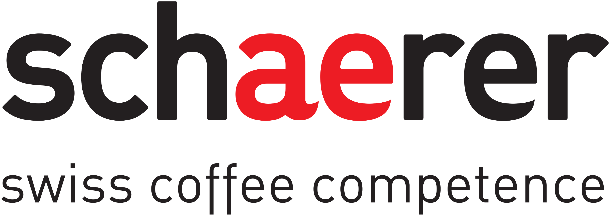

# 💼 Berufliche Projekte

Eine Sammlung von Projekten aus meinem beruflichen Alltag, die technische Herausforderungen analysieren und softwaregestützte Lösungen implementieren. Die Projekte reichen von Embedded-System-Anpassungen über Prozessautomatisierung bis zur ERP-Systementwicklung.

---

## 🔍 Messen der Brüher Einwurfposition (Schaerer)

**Problem:**  
Frisch gemahlener Kaffee landete teilweise nicht im Brüher, sondern im Satzbehälter – vor allem bei Maschinen im Dauerbetrieb.

**Ursache:**  
Das Brühermotor-Moment ist temperaturabhängig. Da Einwurf-/Auswurf-Positionen zeitbasiert angesteuert wurden, verschoben sich diese mit der Zeit.

**Lösung:**  
Verwendung eines Encoders zur exakten Positionsbestimmung.

**Lösungsweg:**  
- Durchführung eines Dauertests mit verschiedenen Brühern und Motoren.  
- Aufzeichnung von über 150 Videos je Setup.  
- Automatisierte Bildauswertung mit Python & FFMPEG.  
- Erkennung der Position mittels FFT-Konvolution anhand eines grünen Referenzkreuzes.  
- Effiziente Positionsanalyse und Validierung des Encodereinsatzes.

---

## 🧼 Neuer Milchreinigungsprozess (Schaerer)

**Problem:**  
Ein Grosskunde war mit der bakteriellen Reduktion im bestehenden Reinigungsprozess unzufrieden.

**Ursache:**  
Der Prozess war nicht effektiv genug gegenüber Bakterien – trotz Einhaltung der EU-Normen.

**Lösung:**  
Implementierung eines Reinigungsprozesses mit Dampfstoss-Desinfektion, welcher die Keimbelastung um den Faktor 100.000 senkt.

**Lösungsweg:**  
- Analyse etablierter Prozesse in der Landwirtschaft (z.B. Melkmaschinen).  
- Umsetzung von vier Reinigungsstufen (Grobreinigung, Chemie, Spülung, Desinfektion).  
- Enge Zusammenarbeit mit Testing- und Entwicklerteams zur Aktor-/Sensorabstimmung.  
- Einführung eines mehrsekündigen Dampfstosses als Desinfektionsschritt.

---

## 🎞️ Media Converter Tool (Schaerer)

**Bedarf:**  
Grosskunden wollten Werbevideos auf der Kaffeemaschinen abspielen.

**Problem:**  
Das Embedded-System unterstützte nur bestimmte Formate und Codecs.

**Lösung:**  
Entwicklung eines plattformkonformen Konverters, sodass PM und Tech-Support Videos ohne Hilfe der Softwareabteilung konvertieren konnten.

**Lösungsweg:**  
- Python-basiertes EXE-Tool entwickelt.  
- Nutzung von FFMPEG zur automatischen Video-Konvertierung.

---

## 🌱 Auftragsimport LANDI (Bison)

**Projektumfang:**   
- 2–3 Entwickler, 1 Hauptprojektleiter + weitere je nach Bedarf
- 12 Sprints à 2 Wochen  

**Problem:**  
Bestellungen vom Online-Shop wurden per PDF übermittelt und manuell bei der LANDI verarbeitet (Auftrag erstellt).

**Lösung:**  
Digitalisierung und Automatisierung des Auftragsprozesses.

**Lösungsweg:**  
- Automatischer Import von Warenkorb-Inhalten.  
- Anbindung an Integration Services und ERP-Systeme.

---

## 💰 Einführung neue MwSt.-Satz (Bison)

**Projektumfang:**    
- 3 Entwickler (Mehrere Scrum-Teams), 1 Projektleiter  
- 3 Sprints à 2 Wochen

**Hintergrund:**  
Ab dem 1. Januar 2024:  
- Normalsatz: 8,1 % (vorher 7,7 %)  
- Reduzierter Satz: 2,6 % (vorher 2,5 %)

**Herausforderung:**  
- Breite Auswirkungen auf Prozesse (Auftrag, Rechnung, Rabatte, etc).  
- Geringes internes Know-how (letzte Änderung >6 Jahre her).  
- Komplexität durch Sonderfälle (z.B. Lieferung am 31.12., Verbuchung am 02.01.).

---
